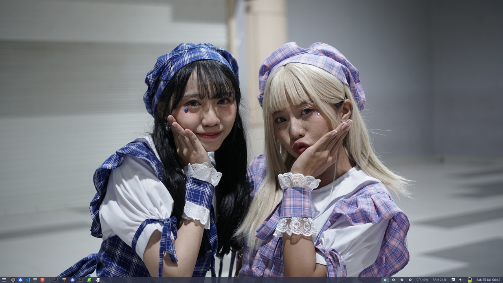

# macOS-style Wayland dotfiles — labwc + dwl (Fedora 42)



Two wlroots compositors side by side, sharing one macOS-like keyboard layer:

- **labwc** — stacking/floating WM (manual window snapping).
- **dwl** — tiling WM (dwm-style, compiled from source).

`Super` is the physical **Cmd** key. `xremap` remaps app-shortcut letters
(`Super+c/v/x/s/z/…`) to their `Ctrl+` equivalents so GUI apps feel mac-like,
while window-management keys fall through to the compositor. Launcher = **fuzzel**
(Spotlight), terminal = **foot** (smart copy: Cmd+C copies, real Ctrl+C = SIGINT),
top bar = **sfwbar**, wallpaper = **waypaper**.

Full keybind reference: [`KEYMAP.en.md`](KEYMAP.en.md) (English) · [`KEYMAP.md`](KEYMAP.md) (Indonesia).

## Layout

```
config/
  xremap/config.yml    # Cmd->Ctrl remap engine (foot block first) — SHARED
  labwc/rc.xml         # labwc window mgmt + system keybinds
  labwc/autostart      # lxpolkit + xremap + waypaper + sfwbar
  labwc/environment    # session env vars
  labwc/menu.xml       # right-click root menu
  labwc/labwc.desktop  # SDDM session entry
  dwl/config.h         # dwl keybinds/appearance (compiled in)
  dwl/autostart.sh     # dwl startup (dwl -s ...)
  dwl/dwl.desktop      # SDDM session entry
  foot/foot.ini        # terminal font/theme
  fuzzel/fuzzel.ini    # launcher look
  sfwbar/sfwbar.config # top menu-bar (launcher + taskbar + clock + status)
  waypaper/            # wallpaper picker (config.ini is git-ignored = state)
Makefile               # symlink manager (labwc setup)
KEYMAP.md              # full keybind reference
CLAUDE.md              # deploy/architecture notes
```

## 1. Install packages (run manually)

```bash
# base — all in Fedora repos
sudo dnf install labwc fuzzel foot grim slurp swaybg wl-clipboard sfwbar waypaper

# xremap — NOT in repos. COPR (preferred):
sudo dnf copr enable emd/xremap        # verify slug: `dnf copr search xremap`
sudo dnf install xremap-wlroots        # wlroots build (labwc/dwl = wlroots)

# … OR cargo fallback if no COPR:
sudo dnf install cargo
cargo install xremap --features wlroots     # binary lands in ~/.cargo/bin
```

> `--features wlroots` is required — the generic build lacks app detection.
> If you used cargo, edit the autostart files to call `~/.cargo/bin/xremap`.

## 2. uinput permissions (xremap injects events as non-root)

```bash
sudo usermod -aG input $USER
echo 'KERNEL=="uinput", GROUP="input", MODE="0660", OPTIONS+="static_node=uinput"' \
  | sudo tee /etc/udev/rules.d/99-uinput.rules
echo uinput | sudo tee /etc/modules-load.d/uinput.conf
sudo modprobe uinput
# log out / reboot so the `input` group membership applies
```

## 3. Deploy the configs (symlink via make)

Repo is the source of truth — `make link` symlinks each `config/<app>` into
`~/.config/<app>` (existing real dirs are backed up to `*.bak`). Editing a file
in the repo takes effect live, no re-copy.

```bash
git clone <your-repo-url> ~/.dotfiles
cd ~/.dotfiles
make link        # symlink config/* -> ~/.config/
make theme       # symlink labwc theme(s) -> ~/.local/share/themes/
mkdir -p ~/Pictures
```

| target | action |
|---|---|
| `make link`   | symlink `config/*` → `~/.config/` (backup real dirs to `.bak`) |
| `make theme`  | symlink `config/labwc/themes/*` → `~/.local/share/themes/` |
| `make unlink` | remove all symlinks, restore `.bak` |
| `make relink` | unlink then re-link + theme |
| `make status` | show each symlink's state |

> `make theme` is separate from `make link` because window themes live in
> `~/.local/share/themes/`, not `~/.config/`.

## 4. labwc — start & verify

- From a TTY: `dbus-run-session labwc`
- Or pick **labwc** in SDDM. Install the session entry once:
  ```bash
  sudo cp config/labwc/labwc.desktop /usr/share/wayland-sessions/
  ```
- Iterating: `labwc --reconfigure` reloads `rc.xml` without restart.

Verify:
1. `pgrep xremap` — running.
2. GUI copy: focus a browser text field → **Super+C / Super+V**.
3. Smart terminal: in foot, select text → **Super+C** copies; `sleep 100` →
   **Ctrl+C** interrupts (SIGINT). Confirms per-app rule active.
4. Window: **Super+Space** fuzzel; **Super+Q** close; **Super+Left/Right** snap;
   **Super+1/2** workspace; **Super+Shift+4**… (see KEYMAP.md; screenshots use `Print`).

## 5. dwl — build & install (optional, for tiling)

dwl has no runtime config — everything lives in `config.h`, compiled in.
**Every keybind change needs a recompile.** Built with clang/LLVM here.

```bash
# build deps (manual, sudo)
sudo dnf install clang make pkgconf-pkg-config lld \
  wlroots-devel wayland-devel wayland-protocols-devel \
  libinput-devel libxkbcommon-devel pixman-devel libdrm-devel

# clone (branch main targets wlroots 0.19, matching Fedora 42's runtime)
git clone https://codeberg.org/dwl/dwl ~/Dokumen/dwl

# use this repo's config.h, then compile
cp ~/.dotfiles/config/dwl/config.h ~/Dokumen/dwl/config.h
cd ~/Dokumen/dwl
make CC=clang \
  CFLAGS="-O3 -march=native -mtune=native -pipe -flto=thin -fuse-ld=lld -DNDEBUG" \
  LDFLAGS="-flto=thin -fuse-ld=lld"
sudo make install

# autostart + SDDM session
mkdir -p ~/.config/dwl && cp ~/.dotfiles/config/dwl/autostart.sh ~/.config/dwl/
chmod +x ~/.config/dwl/autostart.sh
sudo cp ~/.dotfiles/config/dwl/dwl.desktop /usr/share/wayland-sessions/
```

Log out → pick **dwl** in SDDM. Switch back to **labwc** anytime from the same
session menu.

> Note: dwl uses **tags** (not workspaces), so sfwbar's workspace pager won't
> track them; the taskbar (foreign-toplevel) still works. Native dwl bar = dwlb.

## Theming (labwc window decorations)

labwc uses Openbox-style themes (`themerc`). This repo ships **CatppuccinFrappe**
(`config/labwc/themes/CatppuccinFrappe/openbox-3/themerc`), wired via
`<theme><name>CatppuccinFrappe</name></theme>` in `rc.xml`.

- Tweak colors/border: edit the `themerc` (live via symlink) → `labwc --reconfigure`.
- Full key list: `man 5 labwc-theme`.
- **CSD caveat:** GTK/Electron apps draw their own titlebars (client-side
  decoration) and ignore the labwc theme; it applies to server-side-decorated
  windows only.

## Known tradeoffs (by design, not bugs)

- **Cmd+arrow text-nav dropped** — arrows drive window snap (labwc) / master size
  (dwl). Native Home/End still work.
- **Cmd+1..9 browser tabs dropped** — digits switch workspaces/tags. Use Ctrl+Tab.
- **No Mission Control / Exposé** — neither WM has native window-overview.
- **Cmd+W** = app close-tab (`Ctrl+W`); window close = **Cmd+Q**.
- **dwl screenshots use `Print`** (not `Super+Shift+3/4`) — the latter collides
  with move-to-tag.
